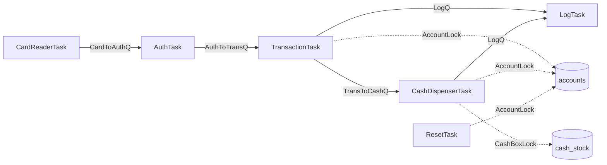

# 광운대학교 임베디드시스템SW설계 — µC/OS-II ATM Simulator

µC/OS-II 기반 ATM 시뮬레이터 프로젝트입니다. 저장소에는 **수업 당시 제출본**과 이후 코드 리뷰를 통해 구조·안전성·테스트 가능성을 개선한 **리팩터링 버전**을 함께 보존합니다.

## Repository layout

```text
.
├── [FINAL]2019202084_배정우/    # 원본 최종 제출물
├── [Assignment1&2]...pdf        # 원본 과제 보고서
├── [PROPOSAL]...pdf             # 원본 제안서
├── refactored/
│   ├── include/
│   ├── src/
│   ├── tests/
│   └── data/
└── .github/workflows/quality.yml
```

> 원본 제출 코드는 과제 당시 구현을 보존하기 위해 그대로 유지합니다. 개선 내용은 `refactored/`에 별도 구현했습니다.

## Architecture



## Refactoring highlights

- 출금마다 ATM 보유 현금이 200,000원으로 초기화되던 버그 수정
- 0원/음수 입금·출금·이체 차단
- 카드 파일 배열 범위 초과 가능성 제거
- `scanf()` 입력을 `fgets() + strtol()` 검증 방식으로 교체
- Queue/Task/메모리 오류 처리 추가
- Queue 전송 실패 시 메시지 반환으로 memory leak 방지
- 실패 거래도 시도 금액 유지
- 이체 로그에 대상 계좌 추가
- 파일 parsing field width 및 반환값 검증
- 계좌 파일 저장을 임시 파일 기반으로 개선
- µC/OS-II Mutex 사용 가능 시 Priority Inheritance 활용
- `OS_MEM_EN > 0`이면 Memory Partition 사용
- `OSResetDailyLimits()` 같은 커널 종속 사용자 함수를 제거하고 application domain으로 이동
- RTOS 비의존 거래 로직을 분리해 Linux CI에서 단위 테스트 가능
- 익명화된 샘플 데이터 제공
- GitHub Actions + cppcheck 추가
- 빌드 산출물은 `.gitignore`로 관리

## Test

```bash
cd refactored
make clean
make all
```

로컬 검증에서는 GCC `-Wall -Wextra -Wpedantic -Werror` 조건으로 domain/storage 모듈 컴파일 및 단위 테스트를 통과했습니다.

## Build environment

원본 Makefile은 Windows MSVC와 특정 uC/OS-II 설치 경로를 전제로 합니다. 리팩터링 버전은 해당 의존성을 명시적으로 분리했습니다.

기본 경로:

```text
C:/software/ucos-II
```

Visual Studio Developer Command Prompt에서:

```bash
cd refactored
make app-msvc
```

다른 경로라면 `UCOS_ROOT`를 지정할 수 있습니다.

자세한 설계와 개선 근거는 [refactored/README.md](refactored/README.md)를 참고하세요.

## Original submission

원본 제출물은 `[FINAL]2019202084_배정우/`에 보존합니다.

- `ATM_machine.c`
- `ATM.h`
- `INCLUDES.H`
- 계좌/카드/매핑 데이터
- 최종 보고서 PDF

이를 통해 **초기 구현 → 코드 리뷰 → 구조 개선 → 테스트 자동화** 과정을 비교할 수 있습니다.
